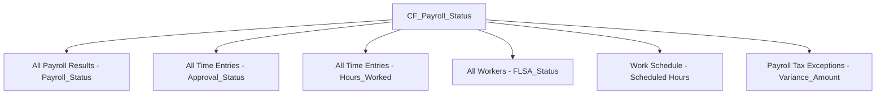

# Payroll Status Calculated Field

## CF_Payroll_Status — Technical Specification

---

## Document Information

| Field | Details |
|-------|---------|
| **Field Name** | CF_Payroll_Status |
| **Workday Object** | Calculated Field |
| **Return Type** | Text |
| **Author** | Payroll Systems Team |
| **Date Created** | 2026-07-23 |
| **Version** | 1.0 |
| **Status** | Draft |

---

## 1. Field Overview

| Attribute | Value |
|-----------|-------|
| **Calculated Field Name** | `CF_Payroll_Status` |
| **Business Purpose** | Determine the processing status of each worker's payroll for a given pay period |
| **Return Type** | Text (20) |
| **Used In Reports** | Payroll Cost Report, Dashboard Overview |
| **Used In Dashboards** | Composite Dashboard (KPI tiles, status distribution chart) |
| **Data Source** | All Payroll Results |
| **Evaluation Frequency** | On-demand (evaluated at report runtime) |
| **Caching** | Eligible for report-level caching; refreshes on payroll calculation events |

---

## 2. Business Logic

### 2.1 Status Definitions

| Status Value | Priority | Business Meaning |
|:-------------|:--------:|------------------|
| **Error** | 1 (Highest) | One or more exceptions detected — missing time entries, failed deduction, or tax withholding mismatch |
| **Pending** | 2 | Payroll has been initiated (calculation started) but has not yet completed successfully |
| **Complete** | 3 | All earnings, deductions, and taxes processed successfully with no outstanding exceptions |
| **Not Started** | 4 (Lowest) | Pay period is open but no payroll action has been taken for this worker |

### 2.2 Evaluation Rules

Priority evaluation ensures the most critical status surfaces first:

1. **Error** is assigned when:
   - Exception count > 0 for the worker in the current pay period, OR
   - Time Entry Status = "Missing" or "Denied" for required time-tracked workers, OR
   - Deduction processing returned a failure flag, OR
   - Tax withholding variance exceeds defined threshold (±$0.01)

2. **Pending** is assigned when:
   - Payroll Result Status = "In Progress" or "Awaiting Approval", AND
   - No exceptions exist

3. **Complete** is assigned when:
   - Payroll Result Status = "Complete", AND
   - Exception count = 0, AND
   - All required time entries are approved (for non-exempt workers)

4. **Not Started** is assigned when:
   - No Payroll Result record exists for the worker in the current pay period, OR
   - Payroll Result Status = "Not Initiated"

---

## 3. Input Fields Referenced

| Input Field | Source Data Source | Data Type | Description |
|-------------|-------------------|-----------|-------------|
| `Payroll_Status` | All Payroll Results | Text (20) | Native payroll calculation status |
| `Calculation_DateTime` | All Payroll Results | DateTime | Timestamp of last payroll calculation |
| `Worker` | All Payroll Results | Reference (Worker) | Worker reference for joining |
| `Pay_Period` | All Payroll Results | Date Range | Pay period being evaluated |
| `Exception_Count` | Derived (sub-filter) | Integer | Count of payroll exceptions for the worker/period |
| `Time_Entry_Status` | All Time Entries | Text (15) | Approval status of time entries (via related lookup) |
| `FLSA_Status` | All Workers | Text (10) | Exempt/Non-Exempt classification |
| `Worker_Status` | All Workers | Text (15) | Active, Terminated, On Leave |

---

## 4. Formula — Workday Calculated Field Syntax

```
/* CF_Payroll_Status
   Determines the consolidated payroll processing status for a worker
   in a given pay period with priority-based evaluation.
   
   Priority: Error > Pending > Complete > Not Started
*/

IF(
  /* Priority 1: ERROR — Any exception detected */
  OR(
    /* Exception count from payroll exceptions sub-filter */
    Greater_Than(
      Count(
        Filter(
          Data_Source: "All Payroll Results",
          Field: "Worker" Equal_To Current_Worker(),
          Field: "Pay_Period" Equal_To Current_Pay_Period(),
          Field: "Payroll_Status" Equal_To "Error"
        )
      ),
      0
    ),
    /* Missing or denied time entries for non-exempt workers */
    AND(
      Equal_To(Field: "FLSA_Status", "Non-Exempt"),
      OR(
        Greater_Than(
          Count(
            Filter(
              Data_Source: "All Time Entries",
              Field: "Worker" Equal_To Current_Worker(),
              Field: "Pay_Period" Equal_To Current_Pay_Period(),
              Field: "Approval_Status" Equal_To "Denied"
            )
          ),
          0
        ),
        Less_Than(
          Sum(
            Filter(
              Data_Source: "All Time Entries",
              Field: "Worker" Equal_To Current_Worker(),
              Field: "Pay_Period" Equal_To Current_Pay_Period(),
              Field: "Approval_Status" In ("Approved", "Submitted")
            ),
            Field: "Hours_Worked"
          ),
          Get_Scheduled_Hours(Current_Worker(), Current_Pay_Period())
        )
      )
    ),
    /* Tax withholding exception detected */
    Greater_Than(
      Count(
        Filter(
          Data_Source: "Payroll Tax Exceptions",
          Field: "Worker" Equal_To Current_Worker(),
          Field: "Pay_Period" Equal_To Current_Pay_Period(),
          Field: "Variance_Amount" Greater_Than 0.01
        )
      ),
      0
    )
  ),
  /* RETURN: Error */
  "Error",

  /* Priority 2: PENDING — Payroll initiated but not complete */
  IF(
    OR(
      Equal_To(Field: "Payroll_Status", "In Progress"),
      Equal_To(Field: "Payroll_Status", "Awaiting Approval")
    ),
    /* RETURN: Pending */
    "Pending",

    /* Priority 3: COMPLETE — All processing successful */
    IF(
      AND(
        Equal_To(Field: "Payroll_Status", "Complete"),
        /* Verify no lingering exceptions */
        Equal_To(
          Count(
            Filter(
              Data_Source: "All Payroll Results",
              Field: "Worker" Equal_To Current_Worker(),
              Field: "Pay_Period" Equal_To Current_Pay_Period(),
              Field: "Payroll_Status" Equal_To "Error"
            )
          ),
          0
        ),
        /* For non-exempt: confirm time entries approved */
        OR(
          Equal_To(Field: "FLSA_Status", "Exempt"),
          Greater_Than_Or_Equal_To(
            Sum(
              Filter(
                Data_Source: "All Time Entries",
                Field: "Worker" Equal_To Current_Worker(),
                Field: "Pay_Period" Equal_To Current_Pay_Period(),
                Field: "Approval_Status" Equal_To "Approved"
              ),
              Field: "Hours_Worked"
            ),
            Get_Scheduled_Hours(Current_Worker(), Current_Pay_Period())
          )
        )
      ),
      /* RETURN: Complete */
      "Complete",

      /* Priority 4: NOT STARTED — No payroll action taken */
      "Not Started"
    )
  )
)
```

### 4.1 Simplified Expression (Pseudocode)

```
CASE
  WHEN exception_count > 0
    OR (flsa_status = 'Non-Exempt' AND time_hours < scheduled_hours)
    OR (flsa_status = 'Non-Exempt' AND denied_time_entries > 0)
    OR tax_variance > 0.01
  THEN 'Error'

  WHEN payroll_status IN ('In Progress', 'Awaiting Approval')
  THEN 'Pending'

  WHEN payroll_status = 'Complete'
    AND exception_count = 0
    AND (flsa_status = 'Exempt' OR approved_hours >= scheduled_hours)
  THEN 'Complete'

  ELSE 'Not Started'
END
```

---

## 5. Configuration

### 5.1 Data Source Placement

| Setting | Value |
|---------|-------|
| **Created In** | Data Source: `All Payroll Results` |
| **Field Category** | Custom Calculated Fields |
| **Security Domain** | Payroll Reports |
| **Available To** | Reports referencing `All Payroll Results` data source |

### 5.2 Output Field Placement

| Report / Dashboard | Usage |
|--------------------|-------|
| Payroll Cost Report | Column display; filter parameter; grouping field |
| Dashboard Overview | KPI tile count by status; status distribution donut chart |
| Composite Dashboard | Real-time status indicators; exception summary tile |

### 5.3 Performance Considerations

| Consideration | Mitigation |
|---------------|------------|
| Sub-filter on `All Time Entries` adds cross-data-source join | Use indexed fields (`Worker`, `Pay_Period`, `Approval_Status`) for filter conditions |
| Exception count requires aggregation per worker/period | Pre-aggregate via related calculated field `CF_Exception_Count` if volume exceeds 100K rows |
| Scheduled hours lookup adds runtime cost | Cache `Get_Scheduled_Hours` result via worker-level calculated field evaluated daily |
| Multiple OR conditions in Error evaluation | Order conditions by likelihood (exception count first — cheapest check) |
| Large pay groups (>5,000 workers) | Partition evaluation by Pay Group; limit report prompts to single Pay Period |

### 5.4 Dependencies



---

## 6. Testing

### 6.1 Test Scenarios — Standard Cases

| Test ID | Scenario | Input Conditions | Expected Result |
|---------|----------|------------------|-----------------|
| TS-01 | Complete payroll, exempt worker | Payroll_Status = "Complete", FLSA = "Exempt", Exception_Count = 0 | **Complete** |
| TS-02 | Complete payroll, non-exempt worker with full hours | Payroll_Status = "Complete", FLSA = "Non-Exempt", Approved_Hours ≥ Scheduled_Hours, Exception_Count = 0 | **Complete** |
| TS-03 | Payroll in progress | Payroll_Status = "In Progress", Exception_Count = 0 | **Pending** |
| TS-04 | Payroll awaiting approval | Payroll_Status = "Awaiting Approval", Exception_Count = 0 | **Pending** |
| TS-05 | Exception — missing time | FLSA = "Non-Exempt", Approved_Hours < Scheduled_Hours | **Error** |
| TS-06 | Exception — denied time entry | FLSA = "Non-Exempt", Denied time entry exists | **Error** |
| TS-07 | Exception — tax variance | Tax variance > $0.01 for worker/period | **Error** |
| TS-08 | Exception — payroll calculation error | Payroll_Status = "Error" in source | **Error** |
| TS-09 | No payroll record exists | No row in All Payroll Results for worker/period | **Not Started** |
| TS-10 | Payroll status = Not Initiated | Payroll_Status = "Not Initiated" | **Not Started** |

### 6.2 Test Scenarios — Edge Cases

| Test ID | Scenario | Input Conditions | Expected Result | Notes |
|---------|----------|------------------|-----------------|-------|
| TS-11 | Mid-period termination | Worker terminated mid-pay-period; partial hours expected | **Complete** (if prorated hours met) or **Error** (if hours short) | Scheduled hours must be prorated to termination date |
| TS-12 | Retroactive pay change | Retro adjustment creates new payroll result after original completion | **Pending** | New calculation result status = "In Progress" for retro run |
| TS-13 | Worker on leave (full period) | Worker_Status = "On Leave", no time entries required | **Complete** (if payroll processed) or **Not Started** | Leave workers may have zero scheduled hours |
| TS-14 | Off-cycle payroll run | Run_Category = "Off-Cycle", separate from regular | Evaluated independently per run | Each run category produces its own status |
| TS-15 | Multiple exceptions | Missing time AND tax variance for same worker | **Error** | Single Error status regardless of exception count |
| TS-16 | Exempt worker with no payroll record | Salaried exempt, pay period open, no calc run | **Not Started** | No time entry validation required |
| TS-17 | Time entries submitted but not approved | FLSA = "Non-Exempt", all time submitted, none approved yet | **Error** | Approved_Hours = 0 < Scheduled_Hours triggers Error |
| TS-18 | Correction after Error | Exception resolved, payroll recalculated successfully | **Complete** | Status must update on recalculation |

### 6.3 Validation Queries

```
/* Verify Error status count matches exception report */
SELECT COUNT(*)
FROM All_Payroll_Results
WHERE CF_Payroll_Status = 'Error'
  AND Pay_Period = [Current Period]

/* Should equal */
SELECT COUNT(DISTINCT Worker)
FROM Payroll_Exceptions
WHERE Pay_Period = [Current Period]
  AND Resolution_Status = 'Open'
```

```
/* Verify no workers have both Complete and Error */
SELECT Worker, COUNT(DISTINCT CF_Payroll_Status) as status_count
FROM All_Payroll_Results
WHERE Pay_Period = [Current Period]
  AND Run_Category = 'Regular'
GROUP BY Worker
HAVING COUNT(DISTINCT CF_Payroll_Status) > 1
/* Expected: 0 rows (each worker should have exactly one status per run) */
```

---

## 7. Maintenance & Change Log

| Version | Date | Change Description | Author |
|---------|------|--------------------|--------|
| 1.0 | 2026-07-23 | Initial specification | Payroll Systems Team |

---

## 8. Related Calculated Fields

| Field Name | Relationship |
|------------|-------------|
| `CF_Exception_Count` | Input — provides aggregated exception count per worker/period |
| `CF_Missing_Time` | Input — identifies workers with insufficient time entries |
| `CF_Tax_Exception` | Input — flags tax withholding variances |
| `CF_Deduction_Check` | Input — identifies failed deduction processing |
| `CF_Overtime_Hours` | Informational — not a direct input but may correlate with exceptions |
