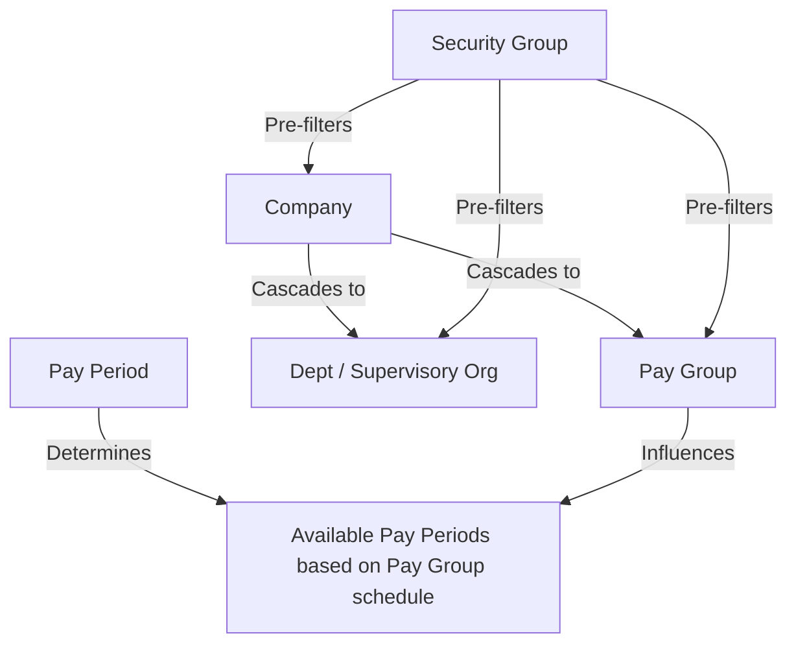

# Filters

## Payroll Exception & Reporting Dashboard

---

## Document Information

| Field | Details |
|-------|---------|
| **Project Name** | Workday Payroll Exception & Reporting Dashboard |
| **Document Version** | 1.0 |
| **Author** | Payroll Systems Team |
| **Date Created** | 2026-07-22 |
| **Status** | Draft |
| **Reference** | Data_Sources.md, Business_Objects.md, Security.md |

---

## 1. Common Filters (Applied Across All Reports)

These filters are shared across all sub-reports in the composite dashboard. When applied at the dashboard level, they cascade to each underlying report.

### 1.1 Common Filter Configuration Table

| Filter Name | Field Reference | Type | Control | Default Value | Required | Cascade Parent |
|-------------|----------------|------|---------|---------------|:--------:|----------------|
| Pay Period | `Payroll_Result.Pay_Period` | Date Range | Date Picker | Current Pay Period | Yes | — |
| Company | `Worker.Company` | Reference | Multi-Select Dropdown | All Companies | Yes | — |
| Pay Group | `Worker.Pay_Group` | Reference | Multi-Select Dropdown | All Pay Groups | No | Company |
| Department / Supervisory Org | `Worker.Supervisory_Org` | Reference | Multi-Select Tree | All Departments | No | Company |
| Worker Status | `Worker.Worker_Status` | Text | Multi-Select Dropdown | Active | No | — |

### 1.2 Common Filter Definitions

#### Pay Period

| Attribute | Value |
|-----------|-------|
| **Field** | `Payroll_Result.Pay_Period` |
| **Data Type** | Date Range |
| **Control Type** | Date Picker with preset options |
| **Default** | Current Pay Period |
| **Required** | Yes |
| **Preset Options** | Current Period, Last Period, Last 3 Periods, Last 6 Periods, Custom Range |
| **Validation** | Start date must be ≤ End date; range cannot exceed 12 months |
| **Dynamic Logic** | "Current Period" resolves to the most recent completed or in-progress pay period for the user's primary pay group |

#### Company

| Attribute | Value |
|-----------|-------|
| **Field** | `Worker.Company` |
| **Data Type** | Reference (Company) |
| **Control Type** | Multi-Select Dropdown |
| **Default** | All companies the user has security access to |
| **Required** | Yes (at least one must be selected) |
| **Cascading** | Selecting a Company filters the Pay Group and Department dropdowns to show only values within the selected company |
| **Security** | List is pre-filtered by the user's security group; only accessible companies are shown |

#### Pay Group

| Attribute | Value |
|-----------|-------|
| **Field** | `Worker.Pay_Group` |
| **Data Type** | Reference (Pay Group) |
| **Control Type** | Multi-Select Dropdown |
| **Default** | All (within selected Company) |
| **Required** | No |
| **Cascading** | Dependent on Company filter; selecting a Pay Group does not further cascade |
| **Security** | Payroll Analysts see only their assigned pay groups; Admins see all |

#### Department / Supervisory Organization

| Attribute | Value |
|-----------|-------|
| **Field** | `Worker.Supervisory_Org` |
| **Data Type** | Reference (Organization) |
| **Control Type** | Multi-Select Hierarchy Tree |
| **Default** | All (within selected Company) |
| **Required** | No |
| **Cascading** | Dependent on Company filter; supports drill-down through org hierarchy |
| **Hierarchy** | Selecting a parent org includes all subordinate organizations |
| **Security** | HR Partners see only their assigned orgs; Managers see only their direct org |

#### Worker Status

| Attribute | Value |
|-----------|-------|
| **Field** | `Worker.Worker_Status` |
| **Data Type** | Text (enumerated) |
| **Control Type** | Multi-Select Dropdown |
| **Default** | Active |
| **Required** | No |
| **Options** | Active, On Leave, Terminated |
| **Logic** | Terminated workers are included only if termination date falls within the selected pay period |

---

## 2. Report-Specific Filters

### 2.1 Overtime Exception Report Filters

| Filter Name | Field Reference | Type | Control | Default Value | Required | Condition |
|-------------|----------------|------|---------|---------------|:--------:|-----------|
| Hours Threshold | `CF_Overtime_Hours.Weekly_Hours` | Numeric | Numeric Input | 40 | No | Include workers where Weekly_Hours > threshold |
| Earning Code | `Time_Entry.Time_Type` | Reference | Multi-Select Dropdown | Regular, Overtime | No | Filter by specific earning/time type codes |
| FLSA Status | `Worker.FLSA_Status` | Text | Single-Select | Non-Exempt | No | Restrict to Non-Exempt workers only |
| Pay Rate Type | `Worker.Pay_Rate_Type` | Text | Single-Select | Hourly | No | Restrict to Hourly workers |

#### Filter Logic

```
WHERE CF_Overtime_Hours.Weekly_Hours > [Hours Threshold]
  AND Worker.FLSA_Status = [FLSA Status]
  AND Worker.Pay_Rate_Type IN ([Pay Rate Type])
  AND Time_Entry.Time_Type IN ([Earning Code])
  AND [Common Filters Applied]
```

---

### 2.2 Tax Exception Report Filters

| Filter Name | Field Reference | Type | Control | Default Value | Required | Condition |
|-------------|----------------|------|---------|---------------|:--------:|-----------|
| Tax Type | `Tax_Result.Tax_Type` | Reference | Multi-Select Dropdown | All (Federal, State, Local) | No | Filter by tax category |
| Tax Jurisdiction | `Tax_Result.Jurisdiction` | Reference | Multi-Select Dropdown | All | No | Filter by state/local jurisdiction |
| Variance Threshold (%) | Calculated | Numeric | Numeric Input | 10 | No | Flag exceptions where period-over-period variance > threshold |
| Variance Threshold ($) | Calculated | Numeric (Currency) | Numeric Input | 50.00 | No | Flag exceptions where absolute dollar variance > threshold |
| Exception Type | `CF_Tax_Exception.Exception_Type` | Text | Multi-Select Dropdown | All | No | Missing withholding, Rate mismatch, Jurisdiction error |

#### Filter Logic

```
WHERE (
    ABS(CF_Tax_Exception.Variance_Pct) > [Variance Threshold (%)]
    OR ABS(CF_Tax_Exception.Variance_Amt) > [Variance Threshold ($)]
  )
  AND Tax_Result.Tax_Type IN ([Tax Type])
  AND Tax_Result.Jurisdiction IN ([Tax Jurisdiction])
  AND CF_Tax_Exception.Exception_Type IN ([Exception Type])
  AND [Common Filters Applied]
```

---

### 2.3 Missing Time Entries Report Filters

| Filter Name | Field Reference | Type | Control | Default Value | Required | Condition |
|-------------|----------------|------|---------|---------------|:--------:|-----------|
| Time Entry Status | `CF_Missing_Time.Entry_Status` | Text | Multi-Select Dropdown | Missing, Incomplete | No | Filter by time entry status |
| Time Tracking Eligible Only | `Worker.Time_Tracking_Eligible` | Boolean | Checkbox | Checked (Yes) | No | Exclude salaried/exempt workers not on time tracking |
| Minimum Missing Days | `CF_Missing_Time.Missing_Day_Count` | Numeric | Numeric Input | 1 | No | Minimum number of missing days to include |

#### Filter Logic

```
WHERE CF_Missing_Time.Entry_Status IN ([Time Entry Status])
  AND Worker.Time_Tracking_Eligible = [Time Tracking Eligible Only]
  AND CF_Missing_Time.Missing_Day_Count >= [Minimum Missing Days]
  AND [Common Filters Applied]
```

---

### 2.4 Deduction Exception Report Filters

| Filter Name | Field Reference | Type | Control | Default Value | Required | Condition |
|-------------|----------------|------|---------|---------------|:--------:|-----------|
| Variance Threshold ($) | Calculated | Numeric (Currency) | Numeric Input | 50.00 | No | Flag deductions where absolute variance > dollar threshold |
| Variance Threshold (%) | Calculated | Numeric | Numeric Input | 10 | No | Flag deductions where percentage variance > threshold |
| Deduction Category | `Deduction_Result.Deduction_Category` | Reference | Multi-Select Dropdown | All | No | Pre-Tax, Post-Tax, Garnishment |
| Benefit Plan | `Deduction_Result.Benefit_Plan` | Reference | Multi-Select Dropdown | All | No | Specific benefit plan selection |
| Exception Type | `CF_Deduction_Exception.Exception_Type` | Text | Multi-Select Dropdown | All | No | New deduction, Stopped deduction, Variance, Missing |

#### Filter Logic

```
WHERE (
    ABS(CF_Deduction_Exception.Variance_Pct) > [Variance Threshold (%)]
    OR ABS(CF_Deduction_Exception.Variance_Amt) > [Variance Threshold ($)]
    OR CF_Deduction_Exception.Exception_Type IN ('New', 'Stopped', 'Missing')
  )
  AND Deduction_Result.Deduction_Category IN ([Deduction Category])
  AND Deduction_Result.Benefit_Plan IN ([Benefit Plan])
  AND [Common Filters Applied]
```

---

### 2.5 Payroll Cost Summary Report Filters

| Filter Name | Field Reference | Type | Control | Default Value | Required | Condition |
|-------------|----------------|------|---------|---------------|:--------:|-----------|
| Cost Center | `Worker.Cost_Center` | Reference | Multi-Select Dropdown | All | No | Filter by financial cost center |
| Earning Category | `Earning_Result.Earning_Category` | Reference | Multi-Select Dropdown | All | No | Regular, Overtime, Bonus, Allowance |
| Run Category | `Payroll_Result.Run_Category` | Reference | Multi-Select Dropdown | All (Regular, Off-Cycle, On-Demand) | No | Filter by payroll run type |
| Include Employer Costs | N/A | Boolean | Checkbox | Checked (Yes) | No | Include employer taxes and contributions in totals |

#### Filter Logic

```
WHERE Worker.Cost_Center IN ([Cost Center])
  AND Earning_Result.Earning_Category IN ([Earning Category])
  AND Payroll_Result.Run_Category IN ([Run Category])
  AND [Common Filters Applied]
```

---

## 3. Filter Logic & Conditions

### 3.1 AND/OR Condition Rules

| Rule | Description | Example |
|------|-------------|---------|
| **Within a filter** | Multiple selections within a single filter use **OR** logic | Pay Group = "Biweekly" OR "Monthly" |
| **Between filters** | Different filters are combined using **AND** logic | Pay Group = "Biweekly" AND Department = "Finance" |
| **Nested groups** | Report-specific filters are grouped and combined with AND to common filters | (Report-specific filter group) AND (Common filter group) |
| **Negation** | Exclusion filters use NOT IN | Worker_Status NOT IN ("Terminated") when Terminated is deselected |

### 3.2 Nested Filter Group Structure

```
Final Filter =
  [Security Row-Level Filter]                         -- Applied first (system-enforced)
  AND [Common Filters]                                -- Applied second (user-selected)
    AND Pay_Period = [Selected Period]
    AND Company IN ([Selected Companies])
    AND Pay_Group IN ([Selected Pay Groups] OR ALL)
    AND Supervisory_Org IN ([Selected Orgs] OR ALL)
    AND Worker_Status IN ([Selected Statuses])
  AND [Report-Specific Filters]                       -- Applied third (report-dependent)
    AND (report-specific conditions per Section 2)
```

### 3.3 Dynamic Date Filters

| Date Filter Option | Resolution Logic | Pay Period Calculation |
|--------------------|-----------------|----------------------|
| **Current Period** | Most recent pay period where `Pay_Period.End_Date <= Today` and `Payroll_Status = 'Complete'` | Single period |
| **Last Period** | The pay period immediately preceding Current Period | Single period |
| **Last 3 Periods** | Current Period + 2 preceding periods | 3 periods |
| **Last 6 Periods** | Current Period + 5 preceding periods | 6 periods |
| **Year to Date** | All periods from January 1 of current year through Current Period | Variable |
| **Custom Range** | User-specified start and end dates; matched to pay periods where `Pay_Period.Start_Date >= Custom_Start AND Pay_Period.End_Date <= Custom_End` | Variable |

#### Dynamic Date Resolution Example (Biweekly Pay Group)

```
Today: 2026-07-22

Current Period:  2026-07-06 to 2026-07-19
Last Period:     2026-06-22 to 2026-07-05
Last 3 Periods:  2026-06-08 to 2026-07-19
Last 6 Periods:  2026-04-27 to 2026-07-19
Year to Date:    2026-01-01 to 2026-07-19
```

---

## 4. Filter Configuration Summary Table

### 4.1 Complete Filter-to-Report Mapping

| Filter Name | Type | Default | Required | Dashboard Overview | Overtime | Tax Exception | Missing Time | Deduction Exception | Payroll Cost |
|-------------|------|---------|:--------:|:--:|:--:|:--:|:--:|:--:|:--:|
| Pay Period | Date Range | Current Period | Yes | ✅ | ✅ | ✅ | ✅ | ✅ | ✅ |
| Company | Multi-Select | All | Yes | ✅ | ✅ | ✅ | ✅ | ✅ | ✅ |
| Pay Group | Multi-Select | All | No | ✅ | ✅ | ✅ | ✅ | ✅ | ✅ |
| Dept / Sup Org | Multi-Select Tree | All | No | ✅ | ✅ | ✅ | ✅ | ✅ | ✅ |
| Worker Status | Multi-Select | Active | No | ✅ | ✅ | ✅ | ✅ | ✅ | ✅ |
| Hours Threshold | Numeric | 40 | No | — | ✅ | — | — | — | — |
| Earning Code | Multi-Select | Regular, OT | No | — | ✅ | — | — | — | — |
| FLSA Status | Single-Select | Non-Exempt | No | — | ✅ | — | — | — | — |
| Tax Type | Multi-Select | All | No | — | — | ✅ | — | — | — |
| Tax Jurisdiction | Multi-Select | All | No | — | — | ✅ | — | — | — |
| Variance Threshold (%) | Numeric | 10 | No | — | — | ✅ | — | ✅ | — |
| Variance Threshold ($) | Numeric (Currency) | $50.00 | No | — | — | ✅ | — | ✅ | — |
| Time Entry Status | Multi-Select | Missing, Incomplete | No | — | — | — | ✅ | — | — |
| Time Tracking Eligible | Checkbox | Yes | No | — | — | — | ✅ | — | — |
| Min Missing Days | Numeric | 1 | No | — | — | — | ✅ | — | — |
| Deduction Category | Multi-Select | All | No | — | — | — | — | ✅ | — |
| Benefit Plan | Multi-Select | All | No | — | — | — | — | ✅ | — |
| Exception Type (Ded) | Multi-Select | All | No | — | — | — | — | ✅ | — |
| Cost Center | Multi-Select | All | No | — | — | — | — | — | ✅ |
| Earning Category | Multi-Select | All | No | — | — | — | — | — | ✅ |
| Run Category | Multi-Select | All | No | — | — | — | — | — | ✅ |
| Include Employer Costs | Checkbox | Yes | No | — | — | — | — | — | ✅ |

### 4.2 Filter Dependencies



---

## 5. Filter Behavior Notes

### 5.1 "All" Selection Behavior

- When a non-required multi-select filter is left at "All," no filter condition is applied for that field
- "All" respects the user's security scope — a Payroll Analyst selecting "All" pay groups sees only their assigned groups

### 5.2 Empty Result Handling

- If filter selections result in zero matching records, the report displays a "No data found for the selected criteria" message
- KPI tiles on the Dashboard Overview display 0 values (not blank or error)

### 5.3 Filter Persistence

- Dashboard-level filter selections persist within the user's session
- Navigating between tabs retains filter selections
- Filter selections reset to defaults on new session or page refresh
- Saved filter defaults are managed via Report Prompts (see Prompts.md)

---

## Revision History

| Version | Date | Author | Changes |
|---------|------|--------|---------|
| 1.0 | 2026-07-22 | Payroll Systems Team | Initial filters design document |
