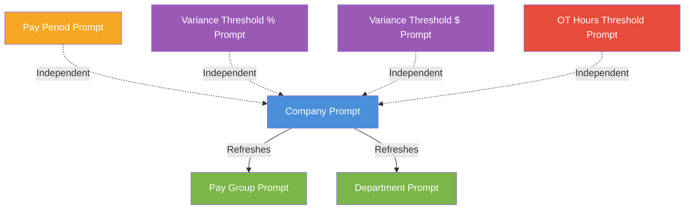

# Prompts

## Payroll Exception & Reporting Dashboard

---

## Document Information

| Field | Details |
|-------|---------|
| **Project Name** | Workday Payroll Exception & Reporting Dashboard |
| **Document Version** | 1.0 |
| **Author** | Payroll Systems Team |
| **Date Created** | 2026-07-22 |
| **Status** | Draft |
| **Reference** | Filters.md, Data_Sources.md, Security.md |

---

## 1. Report Prompts (Runtime User Inputs)

### 1.1 Prompt Summary

| Prompt Name | Data Type | Control Type | Required | Default Value | Cascade Parent | Reports |
|-------------|-----------|-------------|:--------:|---------------|----------------|---------|
| Pay Period | Date Range | Date Picker with presets | Yes | Current Period | — | All |
| Company | Reference (Company) | Multi-Select Dropdown | Yes | All (security-scoped) | — | All |
| Pay Group | Reference (Pay Group) | Multi-Select Dropdown | No | All (within Company) | Company | All |
| Department | Reference (Organization) | Multi-Select Hierarchy Tree | No | All (within Company) | Company | All |
| Exception Threshold (%) | Numeric (Decimal) | Numeric Input | No | 10 | — | Tax Exception, Deduction Exception |
| Exception Threshold ($) | Numeric (Currency) | Numeric Input | No | 50.00 | — | Tax Exception, Deduction Exception |
| Overtime Hours Threshold | Numeric (Decimal) | Numeric Input | No | 40 | — | Overtime Report |

---

## 2. Prompt Configuration

### 2.1 Pay Period Prompt

| Attribute | Value |
|-----------|-------|
| **Prompt Name** | `prompt_Pay_Period` |
| **Label** | Pay Period |
| **Data Type** | Date Range |
| **Control Type** | Date Picker with preset radio buttons |
| **Required** | Yes |
| **Default Value** | Current Period |
| **Validation Rules** | Start date ≤ End date; range cannot exceed 12 months; dates must align to valid pay period boundaries |
| **Help Text** | "Select the pay period or date range for the report. Preset options align to your primary pay group schedule." |

#### Preset Options

| Option | Resolution Logic |
|--------|-----------------|
| Current Period | Most recent pay period with `Payroll_Status = 'Complete'` or `'In Progress'` |
| Last Period | Pay period immediately preceding Current Period |
| Last 3 Periods | Current Period + 2 prior periods |
| Last 6 Periods | Current Period + 5 prior periods |
| Year to Date | All periods from Jan 1 of current year through Current Period |
| Custom Range | User enters start and end dates; system maps to matching pay periods |

#### Behavior

- When the user selects a preset, the date picker auto-populates with the resolved start and end dates
- Custom Range enables manual date entry fields
- If the user's security scope includes multiple pay groups with different schedules, the system uses the user's primary pay group to resolve period boundaries
- Invalid date ranges display an inline validation error: "End date must be on or after start date"

---

### 2.2 Company Prompt

| Attribute | Value |
|-----------|-------|
| **Prompt Name** | `prompt_Company` |
| **Label** | Company |
| **Data Type** | Reference (Company) |
| **Control Type** | Multi-Select Dropdown |
| **Required** | Yes (minimum one selection) |
| **Default Value** | All companies the user has security access to |
| **Validation Rules** | At least one company must be selected |
| **Help Text** | "Select one or more companies. This filters all downstream prompts and report data." |

#### Behavior

- The dropdown is pre-filtered by the user's security group — only companies the user can access appear
- Selecting/deselecting companies triggers a refresh of the Pay Group and Department prompts (cascading)
- "Select All" checkbox available at the top of the dropdown
- For single-company tenants, this prompt is pre-set and read-only

#### Cascading Logic

```
ON Company selection change:
  1. Refresh Pay Group prompt → Show only pay groups within selected companies
  2. Refresh Department prompt → Show only supervisory orgs within selected companies
  3. Reset Pay Group and Department selections to "All"
```

---

### 2.3 Pay Group Prompt

| Attribute | Value |
|-----------|-------|
| **Prompt Name** | `prompt_Pay_Group` |
| **Label** | Pay Group |
| **Data Type** | Reference (Pay Group) |
| **Control Type** | Multi-Select Dropdown |
| **Required** | No |
| **Default Value** | All (within selected Company) |
| **Validation Rules** | None (empty selection = All) |
| **Help Text** | "Optionally filter by pay group. Leave blank to include all pay groups." |

#### Behavior

- Dependent on Company prompt — only pay groups within selected companies are shown
- Payroll Analysts see only their assigned pay groups (security-enforced)
- Payroll Administrators see all pay groups within selected companies
- HR Partners and Managers see all pay groups but row-level security limits the data returned
- "Select All" checkbox available

#### Cascading Logic

```
ON Company change:
  → Pay Group list refreshes to show only pay groups under selected companies
  → Previous Pay Group selections are cleared, reset to "All"

ON Pay Group selection:
  → No downstream cascade (Pay Group is a leaf prompt)
  → Report data filters to selected pay groups
```

---

### 2.4 Department Prompt

| Attribute | Value |
|-----------|-------|
| **Prompt Name** | `prompt_Department` |
| **Label** | Department / Supervisory Organization |
| **Data Type** | Reference (Organization) |
| **Control Type** | Multi-Select Hierarchy Tree |
| **Required** | No |
| **Default Value** | All (within selected Company) |
| **Validation Rules** | None (empty selection = All) |
| **Help Text** | "Optionally filter by department or supervisory organization. Selecting a parent includes all child organizations." |

#### Behavior

- Displayed as a hierarchical tree reflecting the Supervisory Organization structure
- Dependent on Company prompt — only orgs within selected companies are shown
- Selecting a parent organization automatically includes all subordinate orgs
- Users can expand/collapse tree nodes to select specific sub-organizations
- HR Partners see only their assigned org hierarchy (security-enforced)
- Managers see only their direct supervisory org

#### Cascading Logic

```
ON Company change:
  → Department tree refreshes to show only orgs under selected companies
  → Previous Department selections are cleared, reset to "All"

ON Department selection:
  → No downstream cascade (Department is a leaf prompt)
  → Selecting a parent node includes all child nodes in the filter
```

---

### 2.5 Exception Threshold (%) Prompt

| Attribute | Value |
|-----------|-------|
| **Prompt Name** | `prompt_Exception_Threshold_Pct` |
| **Label** | Variance Threshold (%) |
| **Data Type** | Numeric (Decimal, 2 places) |
| **Control Type** | Numeric Input |
| **Required** | No |
| **Default Value** | 10 |
| **Validation Rules** | Must be ≥ 0 and ≤ 100; numeric only |
| **Help Text** | "Set the percentage variance threshold for flagging exceptions. Workers whose period-over-period variance exceeds this percentage will be included." |

#### Behavior

- Applicable to Tax Exception Report and Deduction Exception Report
- Works in conjunction with Exception Threshold ($) — records matching either threshold are included (OR logic)
- If left blank, the default of 10% is applied
- Input is validated on submission; non-numeric entries display an error

---

### 2.6 Exception Threshold ($) Prompt

| Attribute | Value |
|-----------|-------|
| **Prompt Name** | `prompt_Exception_Threshold_Amt` |
| **Label** | Variance Threshold ($) |
| **Data Type** | Numeric (Currency, 2 decimal places) |
| **Control Type** | Numeric Input with currency symbol |
| **Required** | No |
| **Default Value** | 50.00 |
| **Validation Rules** | Must be ≥ 0; numeric only; up to 2 decimal places |
| **Help Text** | "Set the dollar variance threshold for flagging exceptions. Workers whose period-over-period variance exceeds this dollar amount will be included." |

#### Behavior

- Applicable to Tax Exception Report and Deduction Exception Report
- Works in conjunction with Exception Threshold (%) — records matching either threshold are included (OR logic)
- If left blank, the default of $50.00 is applied
- Currency symbol displays based on tenant locale settings

---

### 2.7 Overtime Hours Threshold Prompt

| Attribute | Value |
|-----------|-------|
| **Prompt Name** | `prompt_OT_Hours_Threshold` |
| **Label** | Overtime Hours Threshold |
| **Data Type** | Numeric (Decimal, 2 places) |
| **Control Type** | Numeric Input |
| **Required** | No |
| **Default Value** | 40 |
| **Validation Rules** | Must be > 0 and ≤ 168 (max hours in a week); numeric only |
| **Help Text** | "Set the weekly hours threshold above which workers are flagged for overtime. Default is 40 hours per FLSA standards." |

#### Behavior

- Applicable to Overtime Exception Report only
- Workers with weekly hours exceeding this value are included in the report
- If left blank, the default of 40 is applied
- Standard FLSA threshold is 40; adjust for state-specific rules or organizational policies

---

## 3. Prompt Behavior

### 3.1 Prompt-to-Report Mapping

| Prompt | Dashboard Overview | Overtime Report | Tax Exception | Missing Time | Deduction Exception | Payroll Cost |
|--------|:--:|:--:|:--:|:--:|:--:|:--:|
| Pay Period | ✅ | ✅ | ✅ | ✅ | ✅ | ✅ |
| Company | ✅ | ✅ | ✅ | ✅ | ✅ | ✅ |
| Pay Group | ✅ | ✅ | ✅ | ✅ | ✅ | ✅ |
| Department | ✅ | ✅ | ✅ | ✅ | ✅ | ✅ |
| Variance Threshold (%) | — | — | ✅ | — | ✅ | — |
| Variance Threshold ($) | — | — | ✅ | — | ✅ | — |
| OT Hours Threshold | — | ✅ | — | — | — | — |

### 3.2 Prompt Dependencies & Cascading Flow



**Legend:**
- Blue = Root cascade prompt (drives downstream refreshes)
- Green = Dependent prompts (refreshed by parent)
- Orange = Independent required prompt
- Purple = Independent optional prompt (exception reports)
- Red = Independent optional prompt (overtime report)

### 3.3 Cascading Sequence

| Step | Trigger | Action | Affected Prompts |
|------|---------|--------|-----------------|
| 1 | User selects Company | System refreshes dependent prompts | Pay Group, Department |
| 2 | Pay Group list refreshed | Shows only pay groups within selected companies | Pay Group reset to "All" |
| 3 | Department tree refreshed | Shows only orgs within selected companies | Department reset to "All" |
| 4 | User selects Pay Group | No cascade — leaf prompt | — |
| 5 | User selects Department | No cascade — leaf prompt | — |
| 6 | User clicks "Run Report" / "Apply" | All prompt values passed to report data source filters | Report refreshes |

### 3.4 Saved Prompt Defaults Per User

| Feature | Details |
|---------|---------|
| **Save Defaults** | Users can save their current prompt selections as personal defaults |
| **Implementation** | Workday "Save Prompt Defaults" feature on report execution |
| **Scope** | Per-user, per-report |
| **Behavior** | On next report access, saved defaults pre-populate the prompt fields |
| **Override** | Users can change prompts at runtime; saved defaults are not locked |
| **Clear Defaults** | Users can reset to system defaults via "Clear Saved Defaults" option |
| **Admin Defaults** | Payroll Administrators can set organization-wide default values via report configuration |

---

## 4. Prompt Rendering & UX Specifications

### 4.1 Prompt Layout

```
┌─────────────────────────────────────────────────────────────────┐
│  PAYROLL EXCEPTION DASHBOARD — REPORT PROMPTS                    │
├─────────────────────────────────────────────────────────────────┤
│                                                                  │
│  Pay Period*:  [Current Period ▼]   [ 07/06/2026 ] to [ 07/19/2026 ]  │
│                ○ Current  ○ Last  ○ Last 3  ○ Last 6  ○ YTD  ○ Custom │
│                                                                  │
│  Company*:     [■ All Companies ▼]                               │
│                                                                  │
│  Pay Group:    [■ All Pay Groups ▼]                              │
│                                                                  │
│  Department:   [■ All Departments ▼]  (hierarchy tree)           │
│                                                                  │
│  ── Report-Specific ──────────────────────────────────────────── │
│                                                                  │
│  Variance Threshold (%):  [ 10  ]    (Tax/Deduction reports)     │
│  Variance Threshold ($):  [ $50.00 ] (Tax/Deduction reports)     │
│  OT Hours Threshold:      [ 40  ]    (Overtime report)           │
│                                                                  │
│  [ Apply Filters ]   [ Reset to Defaults ]   [ Save Defaults ]  │
│                                                                  │
└─────────────────────────────────────────────────────────────────┘
```

> **Note:** Fields marked with * are required. Report-specific prompts are shown/hidden based on the active dashboard tab.

### 4.2 Prompt Visibility by Dashboard Tab

| Dashboard Tab | Common Prompts | Report-Specific Prompts Shown |
|---------------|:--------------:|-------------------------------|
| Tab 1: Overview | ✅ | None |
| Tab 2: Overtime Exceptions | ✅ | OT Hours Threshold |
| Tab 3: Tax Exceptions | ✅ | Variance Threshold (%), Variance Threshold ($) |
| Tab 4: Missing Time | ✅ | None (filters only — see Filters.md) |
| Tab 5: Deduction Exceptions | ✅ | Variance Threshold (%), Variance Threshold ($) |
| Tab 6: Payroll Cost | ✅ | None (filters only — see Filters.md) |

### 4.3 Prompt Validation Summary

| Prompt | Validation Rule | Error Message |
|--------|----------------|---------------|
| Pay Period | Start date ≤ End date | "End date must be on or after the start date." |
| Pay Period | Range ≤ 12 months | "Date range cannot exceed 12 months." |
| Company | At least one selected | "Please select at least one company." |
| Variance Threshold (%) | 0 ≤ value ≤ 100 | "Percentage must be between 0 and 100." |
| Variance Threshold ($) | value ≥ 0 | "Dollar amount must be zero or greater." |
| OT Hours Threshold | 0 < value ≤ 168 | "Hours threshold must be between 1 and 168." |

---

## 5. Prompt Integration with Workday Reports

### 5.1 Prompt Parameter Passing

Each prompt value is passed to the report data source as a filter parameter. The mapping is:

| Prompt | Report Parameter Name | Data Source Field | Filter Operator |
|--------|-----------------------|-------------------|----------------|
| Pay Period | `pp_Pay_Period` | `Payroll_Result.Pay_Period` | BETWEEN (start, end) |
| Company | `pp_Company` | `Worker.Company` | IN |
| Pay Group | `pp_Pay_Group` | `Worker.Pay_Group` | IN (or ALL if empty) |
| Department | `pp_Department` | `Worker.Supervisory_Org` | IN (or ALL if empty) |
| Variance Threshold (%) | `pp_Var_Pct` | `CF_*.Variance_Pct` | ABS(value) > threshold |
| Variance Threshold ($) | `pp_Var_Amt` | `CF_*.Variance_Amt` | ABS(value) > threshold |
| OT Hours Threshold | `pp_OT_Threshold` | `CF_Overtime_Hours.Weekly_Hours` | value > threshold |

### 5.2 Composite Dashboard Prompt Sharing

- The composite dashboard passes common prompts (Pay Period, Company, Pay Group, Department) to all sub-reports simultaneously
- Report-specific prompts are passed only to the relevant sub-report(s)
- Changing a prompt value and clicking "Apply" refreshes all visible sub-reports

---

## Revision History

| Version | Date | Author | Changes |
|---------|------|--------|---------|
| 1.0 | 2026-07-22 | Payroll Systems Team | Initial prompts specification document |
